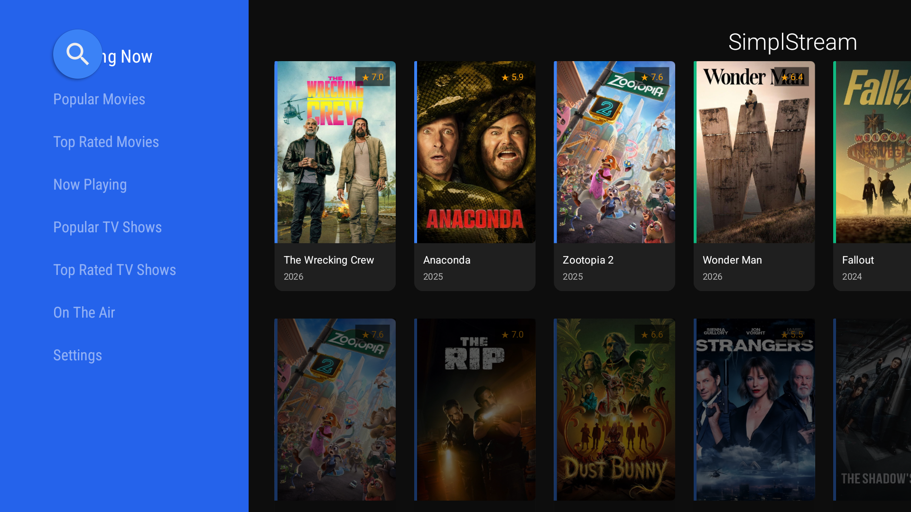
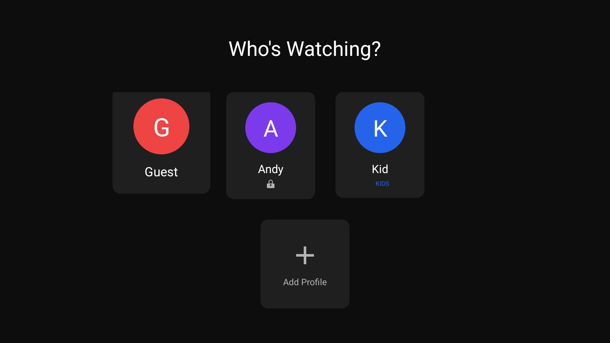
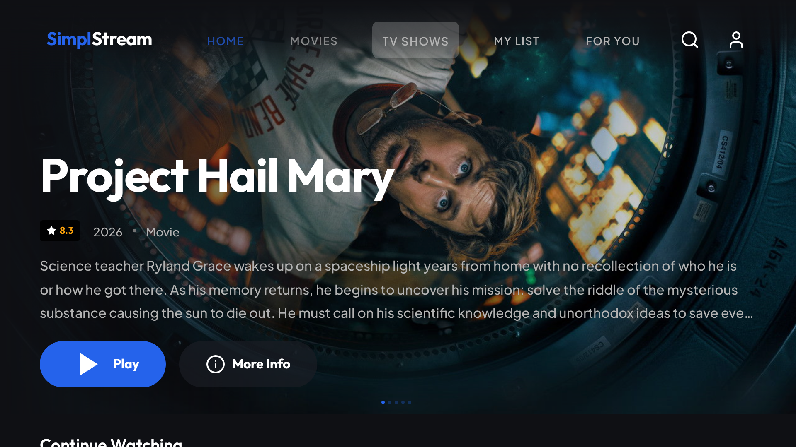
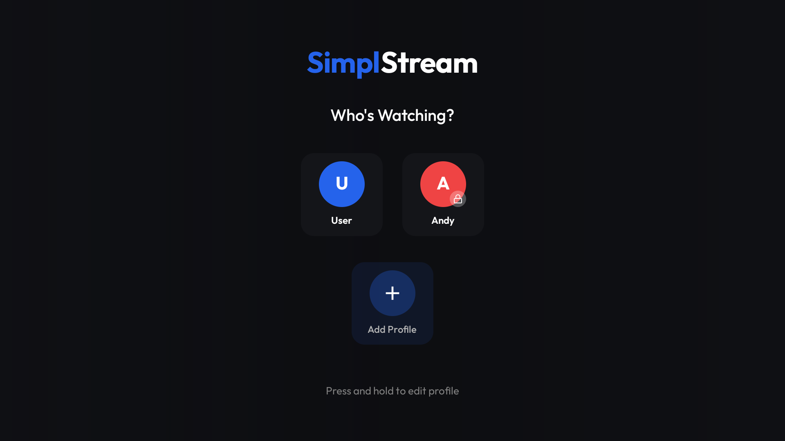
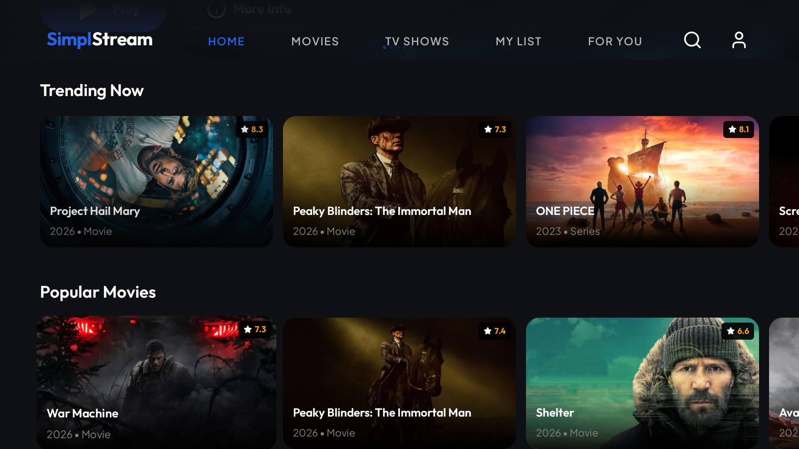
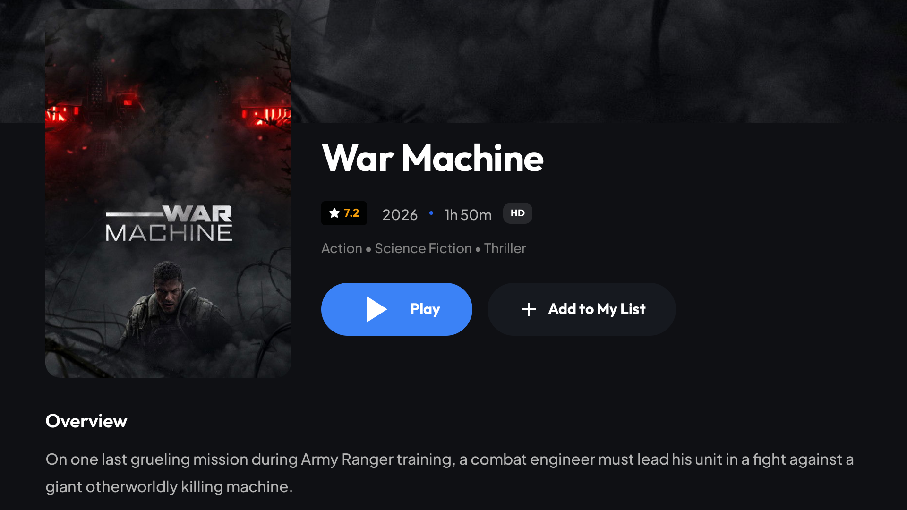

<div align="center">

# 🎬 SimplStreamTV

### ✨ *It's not just streaming. It's SimplStream.* ✨

[](https://github.com/SimplStudios/SimplStreamTV/releases)
[](https://github.com/SimplStudios/SimplStreamTV/releases)

---

💙 **Support us** → [CashApp](https://cash.app/$simplstudiosofficial)

📥 **[Download Latest APK](https://github.com/SimplStudios/SimplStreamTV/releases)** · 🐛 **[Report a Bug](https://github.com/SimplStudios/SimplStreamTV/issues)**

</div>

---

## 🤔 What is SimplStreamTV?

SimplStreamTV is a **free, ad-free streaming app** built from the ground up for your TV.

Not your browser. Not your phone. **Your TV.**

We're talking every movie, every show, every genre — all in one place. No subscriptions. No ads. No "upgrade to premium." No "watch after this 30-second spot." None of that.

> 🎯 **More content than Netflix, Hulu, Disney+, and Prime Video combined.**
>
> We're not exaggerating. Go ahead, search for anything. It's there.

SimplStreamTV was built because we were tired of paying $60/month across four different apps just to watch one show on each. So we made something better. Something that actually respects your time and your wallet.

---

## 🔥 Why SimplStreamTV?

### 🚫 No Ads. Period.
Not "fewer ads." Not "ad-supported tier." **Zero. Ads. Ever.** You press play, it plays. That's it. No interruptions, no banners, no "skip in 5 seconds." We don't do that here.

### ⚡ No Lag, No Buffering
SimplStreamTV uses adaptive streaming that adjusts quality in real-time based on your connection. It starts playing almost instantly — we're talking faster than most paid services. Smooth, crisp, buffer-free.

### 🕐 24/7, Always On
SimplStreamTV doesn't sleep. There's no maintenance window, no "service unavailable," no downtime. It's always ready when you are — whether that's 2pm or 2am.

### 🧠 AI-Powered "For You" Page
This isn't some basic "because you watched X" list. SimplStreamTV's **For You** page actually learns what you like — your genres, your patterns, your taste — and surfaces stuff you'll genuinely enjoy. It gets smarter the more you use it.

### 📺 Built for the Big Screen
This isn't a phone app stretched to fit your TV. SimplStreamTV was **designed for TV from day one.** D-pad navigation that feels natural, a 10-foot UI that looks gorgeous from across the room, and smooth animations everywhere. It feels premium because it is.

### 🔥 Compatible with Fire TV
Got an Amazon Fire Stick? Fire TV Cube? Chromecast with Google TV? **SimplStreamTV runs on all of them.** Sideload it and you're streaming in minutes.

---

## 🌟 Features You'll Actually Use

### 👥 Multiple Profiles
Up to 5 profiles per device — each with their own avatar, color, watchlist, and viewing history. Everyone in your house gets their own space. Just like Netflix, except free.

### 👶 Kids Mode
Turn on Kids Mode for any profile and SimplStreamTV automatically filters out anything inappropriate — horror, violence, adult content, all gone. Parents can lock profiles with a **PIN** so kids can't sneak into the wrong one. Peace of mind, built in.

### 📋 My List
See something you want to watch later? Add it to **My List** with one click. It's saved to your profile and ready whenever you are. No more texting yourself movie names.

### ▶️ Continue Watching
Stopped halfway through a movie? SimplStreamTV remembers exactly where you left off. Come back tomorrow, next week, whenever — it picks up right where you paused.

### 🎬 Cinematic Experience
From the moment you launch the app, SimplStreamTV feels different. A **cinematic startup animation** introduces you to the app, the Netflix-style hero banners showcase what's trending, and every transition is buttery smooth. This isn't some janky side project — it's a real streaming experience.

### 🔍 Search Everything
Looking for something specific? Our search finds it instantly. Movies, TV shows, actors — just type and go. Every result is one click away from playing.

---

## 📸 The Glow Up — v1.0 vs v4.0

We started SimplStreamTV as a basic content browser. Look how far we've come.

<div align="center">

### 📼 v1.0 — Where It All Started
*Basic Leanback grid, blue sidebar, default Android TV look. It worked, but it wasn't pretty.*

| Home Screen | Profile Selection |
|:---:|:---:|
|  |  |

---

### 🚀 v4.0 — The Complete Transformation
*Custom Netflix-style UI, cinematic hero banners, smooth card browsing, premium profile system.*

| Home Screen | Profile Selection |
|:---:|:---:|
|  |  |

| Content Browsing | Detail Page |
|:---:|:---:|
|  |  |

</div>

Same app. Completely reborn. 🔥

---

## 📥 How to Install SimplStreamTV on Your TV

SimplStreamTV isn't on the Google Play Store or Amazon App Store (yet), so you'll need to **sideload** it. Don't worry — it's easy, takes about 5 minutes, and you only have to do it once.

### 📺 Method 1: Using Downloader App (Recommended for Fire TV)

This is the easiest way if you have an Amazon Fire Stick, Fire TV Cube, or any Fire TV device.

**Step 1: Enable Unknown Sources**
1. Go to **Settings** → **My Fire TV** → **Developer Options**
2. Turn on **Apps from Unknown Sources**
3. If you don't see Developer Options, go to **Settings** → **My Fire TV** → **About** → click **Build Number** 7 times to unlock it

**Step 2: Install the Downloader App**
1. Open the **Amazon App Store** on your Fire TV
2. Search for **"Downloader"** (by AFTVnews — it's the orange icon)
3. Install it — it's free

**Step 3: Download SimplStreamTV**
1. Open **Downloader**
2. In the URL field, type the download link from our **[Releases Page](https://github.com/SimplStudios/SimplStreamTV/releases)**
3. It will download the APK automatically
4. When it's done, click **Install**
5. Done! SimplStreamTV will appear in your Apps list 🎉

---

### 📱 Method 2: Using Send Files to TV (Any Android TV)

Works on any Android TV, Google TV, Chromecast with Google TV, Nvidia Shield, etc.

**Step 1: Enable Unknown Sources**
1. Go to **Settings** → **Apps** → **Security & Restrictions**
2. Turn on **Unknown Sources** for your file manager

**Step 2: Get the APK**
1. On your **phone**, download the APK from our **[Releases Page](https://github.com/SimplStudios/SimplStreamTV/releases)**
2. Install **"Send Files to TV"** on both your **phone** and your **TV** (it's free on the Play Store)
3. Open the app on both devices — make sure they're on the same WiFi
4. On your phone, tap **Send** and select the SimplStreamTV APK
5. On your TV, it'll appear automatically — click to install

---

### 💻 Method 3: Using ADB (For the Tech-Savvy)

If you're comfortable with a command line:

```bash
# Connect to your TV (replace with your TV's IP address)
adb connect 192.168.1.XXX:5555

# Install the APK
adb install SimplStreamTV_v4.0.apk
```

Find your TV's IP address in **Settings** → **Network** → **About** or **Status**.

---

### 🔄 Updating SimplStreamTV

When a new version comes out, just repeat the same process — download the new APK and install it. It'll update in place without losing your profiles or watchlist.

---

## 🛠️ Under the Hood

For the developers and curious minds — here's what powers SimplStreamTV v4.0:

- **Kotlin 2.0** with Coroutines & Flow for fully async, non-blocking everything
- **MVVM + Clean Architecture** — proper separation of concerns, repository pattern, the works
- **Custom Netflix-style UI** built on top of AndroidX Leanback, heavily customized
- **ExoPlayer (Media3)** — native video playback with adaptive HLS streaming, no WebView junk
- **Hilt** for dependency injection across the entire app
- **Retrofit + OkHttp + Moshi** for fast, efficient API calls
- **Coil** for image loading with smart memory & disk caching
- **Room + DataStore** for local storage — profiles, watchlists, history, preferences all persist locally
- **Jetpack Navigation** for smooth fragment-based screen transitions
- **Custom Outfit & Plus Jakarta Sans** typefaces for that premium feel
- **SHA-256 encrypted PIN system** for parental controls
- **Multi-provider streaming engine** with automatic fallback

---

## 📄 Legal

SimplStreamTV is for educational and personal use only. We do not host, store, or distribute any copyrighted content. All media metadata is provided by [TMDB](https://www.themoviedb.org/).

---

## 📧 Contact

**SimplStudios** — simplstudios@protonmail.com

💙 Donate: [CashApp](https://cash.app/$simplstudiosofficial)

🔗 Project: [github.com/SimplStudios/SimplStreamTV](https://github.com/SimplStudios/SimplStreamTV)

---

<div align="center">

**Made with 💙 by SimplStudios**

*It's not just streaming. It's SimplStream.* ✨

</div>
